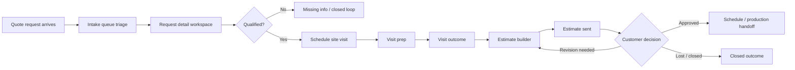

# Internal Admin MVP design package

_Jira: SCRUM-25_

This repo-native design package replaces a Figma-only deliverable for the Internal Admin MVP.
It is grounded in the current Concept-derived admin shell on `main` and must preserve the light shell, navy sidebar, emoji nav icons, and dense operational layout introduced from the Concept baseline (`cb69d08`).

## 1) Workflow map



### Working rules by phase

| Phase | Primary operator goal | Required context | Primary action |
| --- | --- | --- | --- |
| Intake queue | Sort and claim new work fast | urgency, owner, source, requested timeline | assign, change status, open request |
| Request detail | Understand the job without leaving the workspace | customer/site data, attachments, notes, timeline | edit inline, request info, qualify |
| Scheduling workspace | Book or adjust the site visit | date window, contact, field resource, prep notes | schedule, reschedule, confirm |
| Visit prep / outcome | Hand off cleanly between office and field | scope summary, access notes, visit outcome, blockers | prep checklist, record findings |
| Estimate builder | Turn findings into a send-ready estimate | visit outcome, scope, pricing, next step | draft, revise, send |

## 2) Internal Admin information architecture and navigation model

The Internal Admin shell should stay organized around persistent operational sections instead of decorative destinations.

### Primary IA

- **Overview**
  - Dashboard
- **Operations**
  - Requests
  - Calendar
- **Revenue**
  - Estimates
  - Invoices
- **Contact**
  - Customers / contact records
- **Website**
  - Content / public-site surfaces
- **Admin**
  - Settings

### Navigation model

1. The left sidebar is always visible on desktop and remains the primary wayfinding surface.
2. The sidebar groups pages by workflow section, not by technical system.
3. The selected route owns the center workspace; detail context lives in persistent rails and side panels instead of modal-first flows.
4. Mobile keeps the same IA in a temporary drawer without changing labels or hierarchy.
5. Queue-like routes should bias toward a three-part layout:
   - left: filtered list / queue
   - center: active work surface
   - right: contextual notes, status, supporting actions

## 3) Low-fidelity wireframes

### Intake queue

```text
┌──────────────────────────────────────────────────────────────────────────────┐
│ Top bar: route title + current workspace summary                            │
├───────────────┬──────────────────────────────────────┬───────────────────────┤
│ Queue rail    │ Request workspace                    │ Context rail          │
│ - search      │ - request header                     │ - queue metrics       │
│ - lane filter │ - customer + site snapshot          │ - SLA / urgency cues  │
│ - status pill │ - inline edit blocks                │ - workflow rules      │
│ - owner       │ - activity timeline                  │ - next recommended    │
│ - next action │ - attachments / notes               │   action              │
└───────────────┴──────────────────────────────────────┴───────────────────────┘
```

### Request detail

```text
┌──────────────────────────────────────────────────────────────────────────────┐
│ Header: customer, service type, status, owner, next action                  │
├───────────────────────────────┬──────────────────────────────────────────────┤
│ Main record                   │ Persistent side panel                        │
│ - summary cards              │ - qualification state                        │
│ - contact + site inline edit │ - workflow stage                             │
│ - intake / message           │ - scheduling shortcut                         │
│ - attachments                │ - blockers / missing info                    │
│ - timeline / activity        │ - linked estimate or next-step CTA           │
└───────────────────────────────┴──────────────────────────────────────────────┘
```

### Scheduling workspace

```text
┌──────────────────────────────────────────────────────────────────────────────┐
│ Schedule handoff                                                             │
├───────────────────────────────┬──────────────────────────────────────────────┤
│ Left                          │ Right                                        │
│ - date                        │ - request summary                            │
│ - time window                 │ - contact + address                          │
│ - assigned field resource     │ - qualification notes                        │
│ - on-site contact             │ - latest activity                            │
│ - internal prep notes         │ - schedule guardrails                        │
└───────────────────────────────┴──────────────────────────────────────────────┘
```

### Visit prep / outcome

```text
┌──────────────────────────────────────────────────────────────────────────────┐
│ Visit prep / outcome                                                         │
├───────────────────────────────┬──────────────────────────────────────────────┤
│ Prep                          │ Outcome                                      │
│ - access instructions         │ - site findings                              │
│ - material / measuring notes  │ - photos / files                             │
│ - customer expectations       │ - scope changes                              │
│ - known blockers              │ - estimate-ready decision                    │
└───────────────────────────────┴──────────────────────────────────────────────┘
```

### Estimate builder

```text
┌──────────────────────────────────────────────────────────────────────────────┐
│ Estimate builder                                                             │
├───────────────────────┬──────────────────────────────────┬───────────────────┤
│ Scope + pricing       │ Customer-facing packet           │ Internal readiness │
│ - line items          │ - scope summary                 │ - contract state   │
│ - allowances          │ - options / alternates          │ - deposit posture  │
│ - exclusions          │ - send controls                 │ - production notes │
└───────────────────────┴──────────────────────────────────┴───────────────────┘
```

## 4) Interaction spec

### Inline edit

- Prefer inline edit inside the active record instead of launching modal-heavy forms.
- Use clear `Edit inline`, `Save`, and `Cancel` affordances directly on the block being changed.
- Preserve read context while editing so operators do not lose the surrounding request state.

### Persistent side panels

- Treat the right rail as durable context, not a temporary drawer.
- Keep workflow phase, blockers, next step, and linked actions visible while the main canvas changes.
- On narrow screens, the same context can collapse into stacked sections, but content hierarchy should stay intact.

### Timeline / activity

- Activity is chronological, operational, and scannable.
- Include submission, ownership changes, qualification changes, scheduling, visit events, estimate send, and final outcomes.
- Event notes belong directly in the timeline card; do not hide them behind secondary click paths.

### Status transitions

- Every status must imply the next office action.
- Status controls should stay close to ownership and next-step controls.
- Closed / won states should branch clearly into follow-through or archive behavior instead of disappearing from history.

## 5) Empty, loading, and error states

### Empty

- Empty queues should explain what would appear there and offer the next useful action.
- Empty detail panels should preserve layout structure rather than collapsing the workspace.

### Loading

- Use skeleton blocks that mirror final density and layout.
- Keep navigation, shell framing, and route identity visible during load.

### Error

- Errors should preserve the surrounding shell and context.
- Offer a clear retry path plus any fallback action the office can still take.
- Prefer inline error treatment inside the affected workspace instead of full-screen takeovers.

## 6) Implementation notes for engineering

- Build new Internal Admin routes inside the existing shell rather than inventing a second admin chrome.
- Favor dense panels, inline editing, persistent context rails, and workflow grouping.
- Avoid decorative card stacks, floating bubbles, and modal-first primary actions.
- Use this document as the source-of-truth wireframe package until an explicitly approved Figma file exists.
